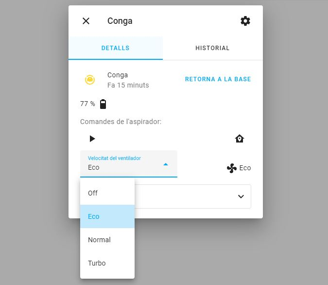

# Cecotec Conga 5290 integration

This integration aims to manage Cecotec Conga 5290 vacuum cleaner which cannot be managed by [FreeConga](https://freecon.ga/) or [BadConga](https://github.com/adrigzr/badconga).

The author of this project categorically rejects any and all responsibility related to vacuums managed by this integration.



## Installation

### HACS (Recommended)

This integration can be added to HACS as a custom repository.

Assuming you have already installed and configured HACS:
1. Go to `HACS > Integrations`
2. Click on the three dots at the upper-right corner and select `custom repositories`.
3. Set `https://github.com/alemuro/ha-cecotec-conga.git` as the repository, and `Integration` as the category.
4. Close this popup and install the `Cecotec Conga` integration.

You're ready! Now continue with the configuration.

### Configuration Through the interface
1. Navigate to `Settings > Devices & Services` and then click `Add Integration`
2. Search for `Cecotec Conga`
3. Enter your credentials

## Supported devices

This integration has been tested with the following vacuum cleaners:

| Model name | Supported?                                                    |
| ---------- | ------------------------------------------------------------- |
| Conga 5290 | ✅ Yes!                                                        |
| Conga 2290 | ❌ [No](https://github.com/alemuro/ha-cecotec-conga/issues/12) |
| Conga 3090 | ❌ [No](https://github.com/alemuro/ha-cecotec-conga/issues/19) |
| Conga 3690 | ❌ [No](https://github.com/alemuro/ha-cecotec-conga/issues/10) |
| Conga 4690 | ❌ [No](https://github.com/alemuro/ha-cecotec-conga/issues/13) |
| Conga 5090 | ❌ [No](https://github.com/alemuro/ha-cecotec-conga/issues/14) |
| Conga 6090 | ❌ [No](https://github.com/alemuro/ha-cecotec-conga/issues/9)  |


[Have you tested a different one and it works? Please tell us!](https://github.com/alemuro/ha-cecotec-conga/issues/new?assignees=&labels=&template=device-tested.md&title=%5BDEVICE-TESTED%5D)

## Supported functionalities

So far the following features have been implemented:
* `TURN_ON` - Enables the button to start the vacuum.
* `RETURN_HOME` (`TURN_OFF` does the same) - Enables the button to return the vacuum to home.
* `BATTERY` - Shows the status of the battery.
* `FAN_SPEED` - Allows changing the speed of the fan when the vacuum is cleaning.
* `SEND_COMMAND` - Allows sending custom commands, like setting water drop or starting a plan (in future releases).

A lot of ideas are in the backlog :) Do you have some idea? [Raise an issue!](https://github.com/alemuro/ha-cecotec-conga/issues/new?assignees=&labels=&template=feature_request.md&title=)

### Set water drop level

This is allowed through the `vacuum.send_command` service. Use the command `set_water_level` and provide the param `water_level` with some of these values: `Off`, `Low`, `Medium` or `High`. Only works when the vacuum is already cleaning. Allowed levels are shown as an attribute of the vacuum entity.

```
service: vacuum.send_command
target:
  entity_id: vacuum.conga
data:
  command: set_water_level
  params:
    water_level: Medium
```

### Start plan

To start a plan called `Cuina`, run the `vacuum.send_command` service with the `start_plan` command, and provide the plan as a parameter. The parameter must be created before from the App.

```
service: vacuum.send_command
target:
  entity_id: vacuum.conga
data:
  command: start_plan
  params:
    plan: Cuina
```

## Developers

### Local testing

If you already have a Conga, I encourage you to test it by executing the `test.py`. 

1. Install dependencies throuhg `pipenv`. Execute `pipenv install`.
2. Open virtualenv: `pipenv shell`.
3. Create a `.env` file with the variables `CONGA_USERNAME`, `CONGA_PASSWORD` and `CONGA_SN` (serial number). The serial number is retrieved by the script.
4. Execute `python test.py`.

There is a Makefile target to start a Docker container with this integration installed as a `custom_component`. Execute `make test-local`. This will create a local folder `.config`. To set debugging mode add this to `.config/configuration.yaml` file:

```
logger:
  default: info
  logs:
    custom_components.cecotec_conga: debug
```

## Legal notice
This is a personal project and isn't in any way affiliated with, sponsored or endorsed by [CECOTEC](https://www.cecotec.es/).

All product names, trademarks and registered trademarks in (the images in) this repository, are property of their respective owners. All images in this repository are used by the project for identification purposes only.
